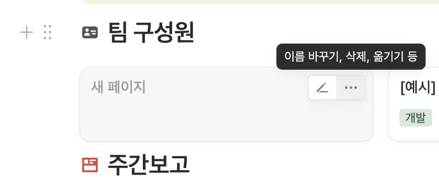
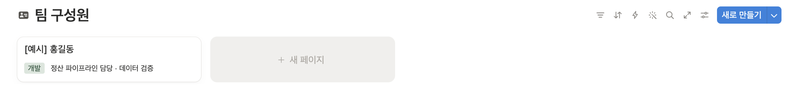
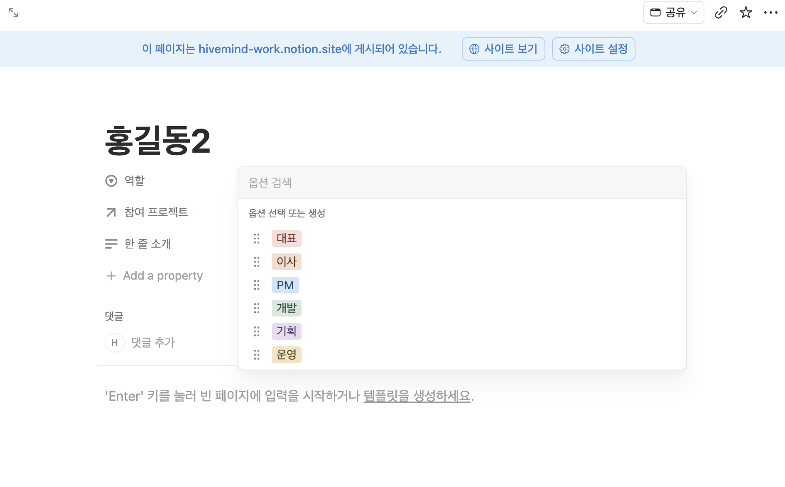
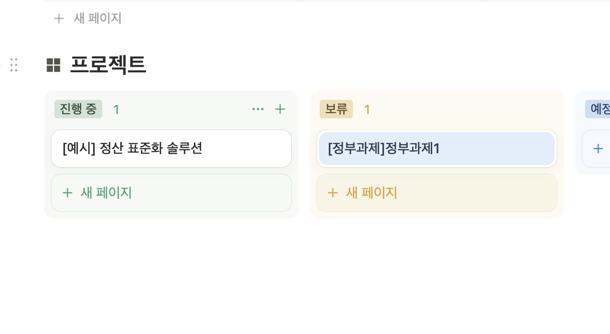
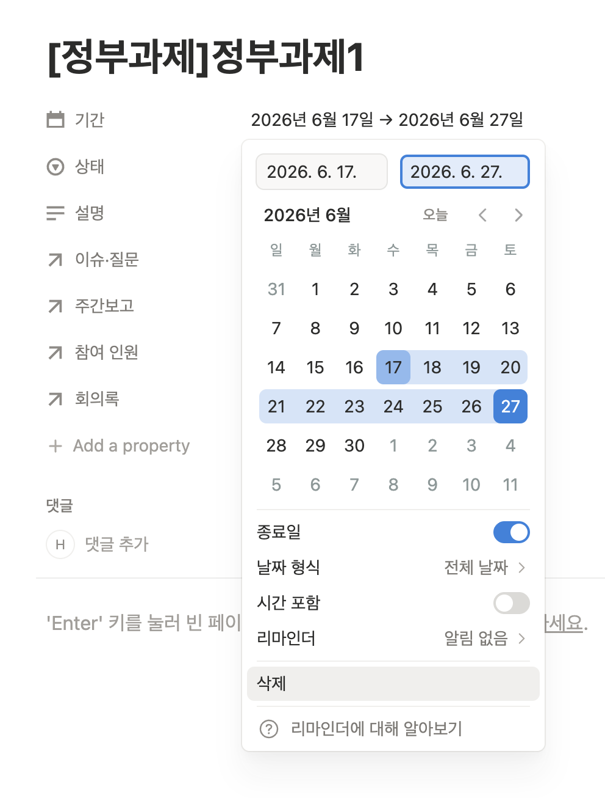
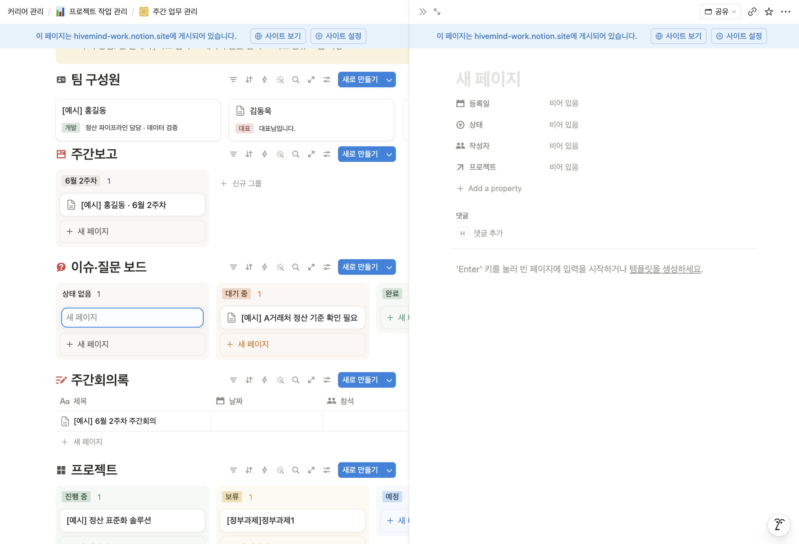
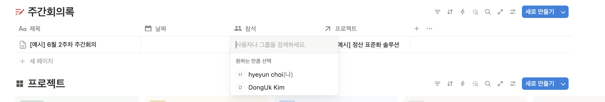
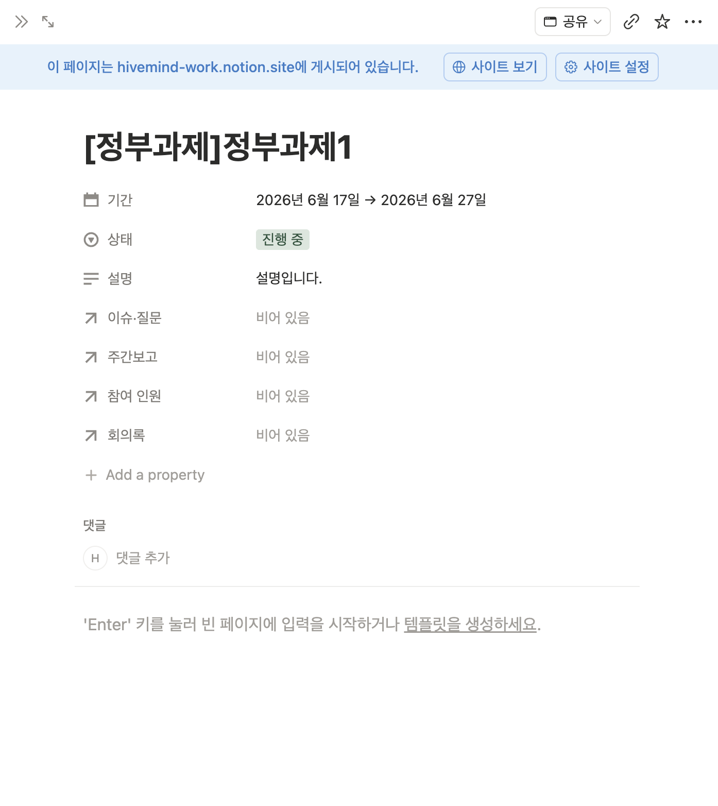
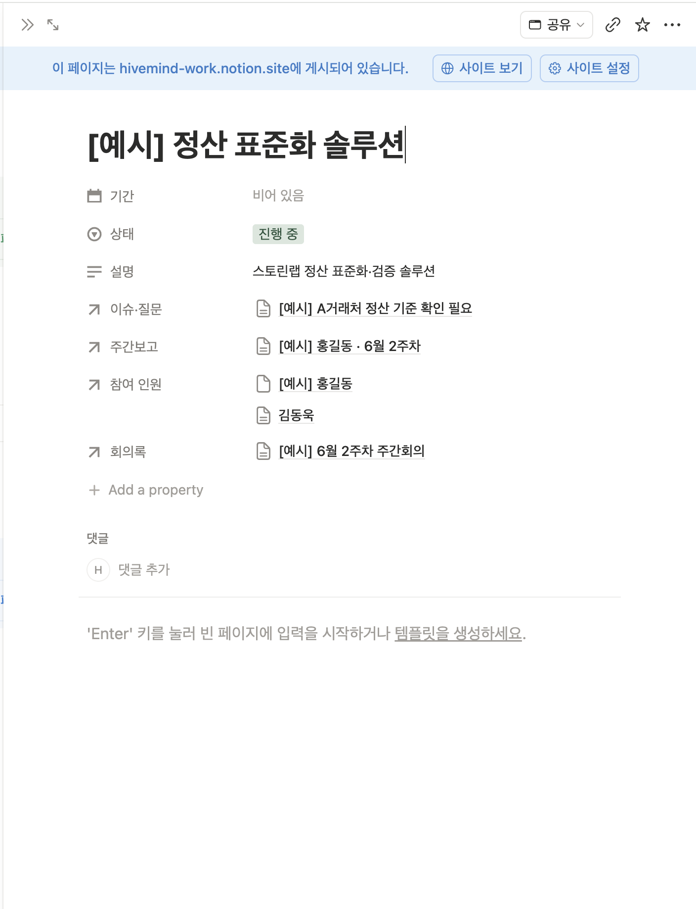
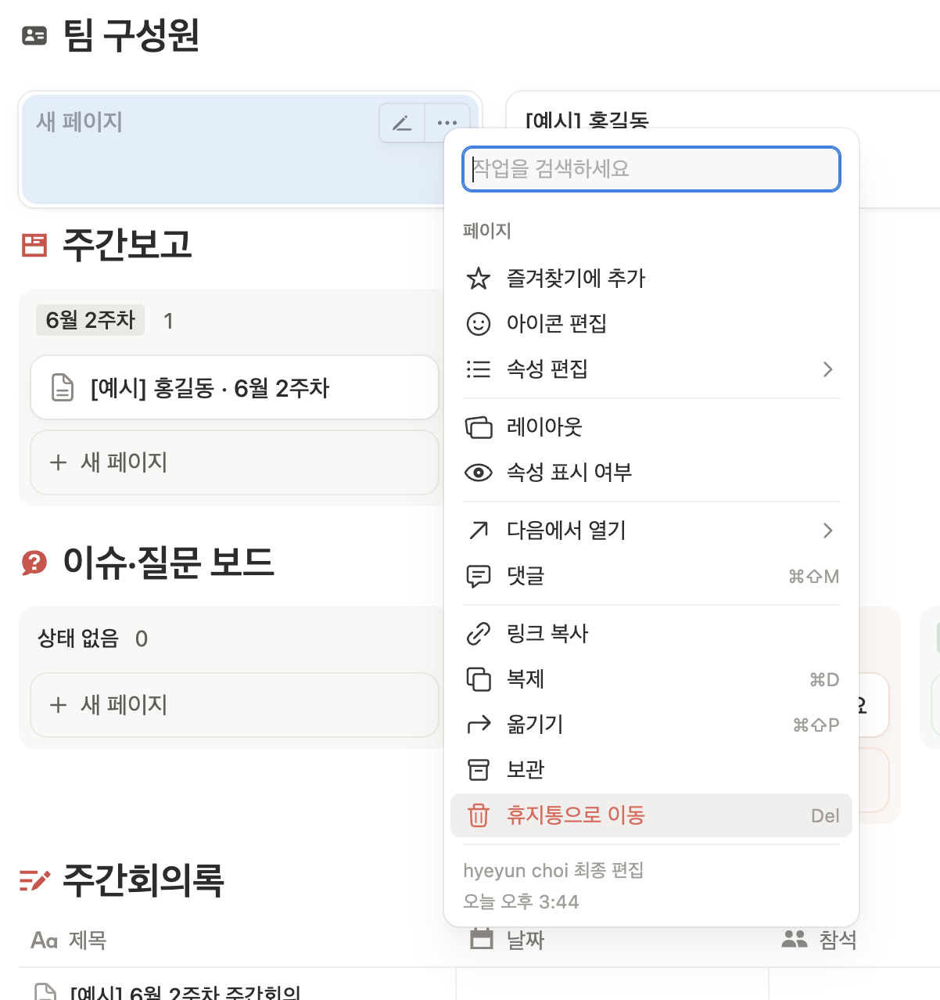

# 노션 주간업무 사용 안내

작성자 최혜윤 · hyeyun.choi@nsion.net · 010-5710-0708 · 작성일 2026. 6. 17.

주간업무 페이지를 처음 사용하실 때 보는 안내서입니다.

페이지 주소 — https://app.notion.com/p/nsion/37da502b05cc819daf5fd7cfae3a9f05
(주소 오른쪽의 별 아이콘을 누르면 즐겨찾기에 추가되어 다시 찾기 쉽습니다.)

* 편집·사용을 위해 계정 초대를 보내드렸습니다. 초대를 수락하신 후 이용하실 수 있습니다.

## 시작하기 전에

- 노션은 표에 내용을 한 줄씩 쌓는 방식입니다. 한 줄이 보고서 하나, 이슈 하나입니다.
- 입력하면 자동으로 저장됩니다. 따로 저장 버튼은 없습니다.
- 잘못 입력했으면 `Ctrl + Z`(맥은 `⌘ + Z`)로 되돌릴 수 있습니다.
- 줄(카드)에 마우스를 올리면 연필 아이콘이 나타납니다. 누르면 페이지가 열려 내용을 자세히 적을 수 있습니다.

<figure>

<figcaption>카드에 마우스를 올리면 나타나는 편집·메뉴 버튼</figcaption>
</figure>

## 1. 팀 구성원 추가

함께 일하는 사람을 먼저 등록합니다. 한 사람은 한 번만 등록합니다.

1. 팀 구성원 표 오른쪽 위의 **새로 만들기**를 누릅니다.
2. 이름을 입력합니다.
3. 역할을 고릅니다. (대표 · 이사 · PM · 개발 · 기획 · 운영)
4. 한 줄 소개를 적습니다. (선택)

<figure>

<figcaption>팀 구성원 표 — 오른쪽 위 새로 만들기</figcaption>
</figure>

<figure>

<figcaption>역할은 목록에서 하나를 고릅니다</figcaption>
</figure>

## 2. 프로젝트 추가

주간보고와 이슈, 회의록이 모이는 단위입니다.

1. 프로젝트 표에서 상태 칸의 **+ 새 페이지**를 누릅니다.
2. 프로젝트명을 입력합니다.
3. 상태를 고릅니다. (예정 · 진행 중 · 보류 · 완료)
4. 기간을 정합니다. 끝나는 날도 넣으려면 **종료일**을 켭니다.
5. 설명을 적고, 참여 인원에서 구성원을 연결합니다.

<figure>

<figcaption>프로젝트는 상태별 칸으로 보입니다</figcaption>
</figure>

<figure>

<figcaption>기간 — 종료일을 켜면 시작일부터 종료일까지 지정됩니다</figcaption>
</figure>

## 3. 주간보고 작성

회의 전날까지 한 주의 내용을 정리합니다.

1. 주간보고 표에서 **새로 만들기**를 누릅니다.
2. 제목, 기간, 주차, 작성자를 입력합니다.
3. 프로젝트를 지정합니다. — 이 항목을 지정해야 해당 프로젝트에 모입니다.
4. 카드를 열어 본문에 한 일, 다음 할 일, 도움이 필요한 점을 적습니다.

## 4. 이슈·질문 등록

막히거나 함께 논의할 일이 생기면 그때그때 올립니다.

1. 이슈·질문 보드에서 **새로 만들기**를 누릅니다.
2. 제목에 요점을 한 줄로 적습니다.
3. 작성자와 프로젝트를 지정합니다.
4. 해결되면 상태를 완료로 바꿉니다.

<figure>

<figcaption>새로 만들기를 누르면 오른쪽에 입력 창이 열립니다 — 등록일·상태·작성자·프로젝트를 채웁니다</figcaption>
</figure>

## 5. 회의록 작성

회의 후 정한 내용을 남깁니다.

1. 주간회의록에서 **새로 만들기**를 누릅니다.
2. 제목, 날짜, 참석자를 입력하고 프로젝트를 지정합니다.
3. 본문에 결정 사항과 다음 할 일을 적습니다.

<figure>

<figcaption>참석 칸을 누르면 구성원 목록에서 참석자를 고를 수 있습니다</figcaption>
</figure>

## 6. 프로젝트에서 모아 보기

주간보고·이슈·회의록을 만들 때 프로젝트만 지정해두면, 프로젝트 페이지에 자동으로 모입니다.
프로젝트 카드를 열면 참여 인원·주간보고·이슈·회의록이 그 프로젝트 것만 모여 보입니다.

<figure>

<figcaption>아직 아무것도 연결되지 않은 프로젝트</figcaption>
</figure>

<figure>

<figcaption>각 항목에서 프로젝트를 지정하면 이렇게 자동으로 모입니다</figcaption>
</figure>

## 참고

- 항목을 만들 때 프로젝트 지정을 빠뜨리면 어디에도 모이지 않습니다. 새로 만들 때 프로젝트를 꼭 골라주세요.
- 삭제와 복제는 카드의 `···` 메뉴에서 합니다. 지운 항목은 페이지 오른쪽 위 `···` 메뉴의 휴지통에서 되살릴 수 있습니다.

<figure>

<figcaption>카드 ··· 메뉴 — 복제, 휴지통으로 이동 등</figcaption>
</figure>
