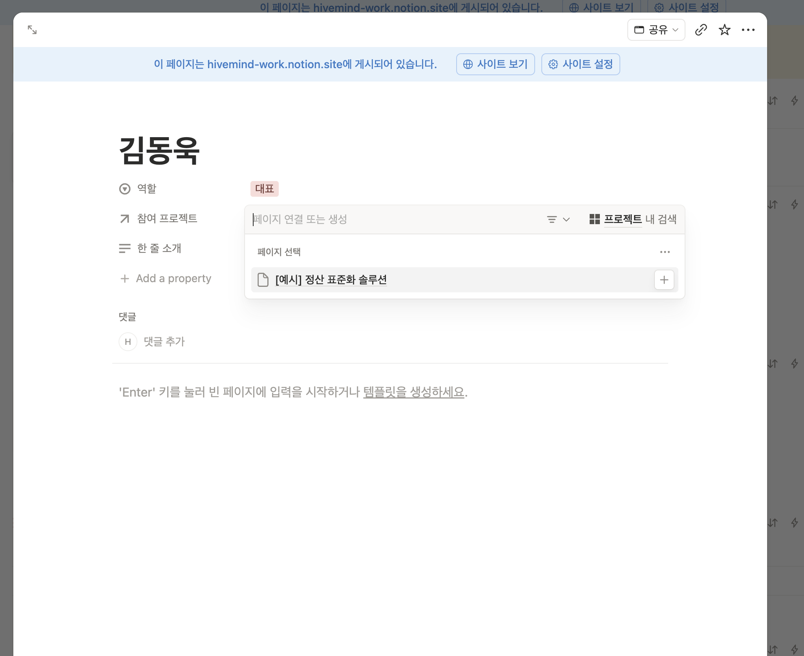
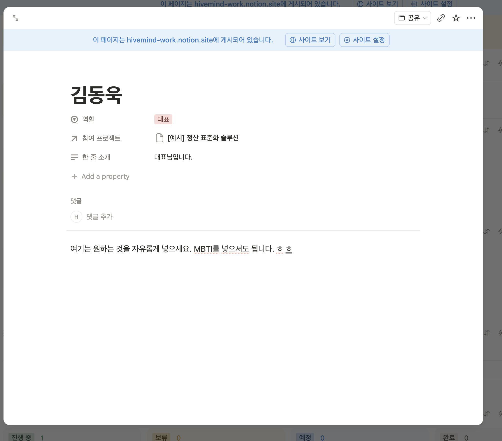
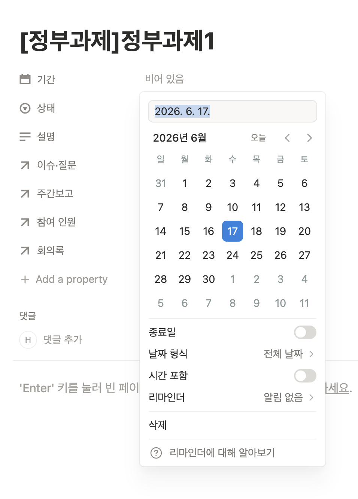
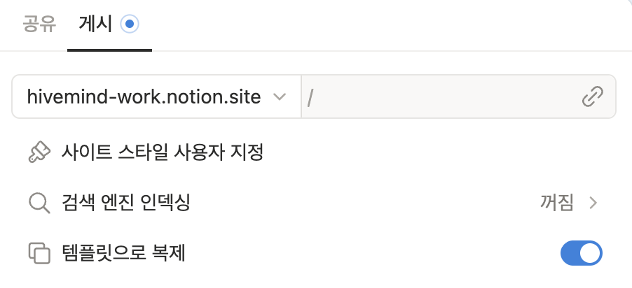

# 하이브마인드 주간업무 노션 사용 가이드

> 노션이 처음이신 분도 이 문서만 그대로 따라 하면 됩니다.
> 인쇄해서 화면 옆에 두고 한 단계씩 보셔도 좋습니다.
>
> **페이지 주소:** https://app.notion.com/p/nsion/37da502b05cc819daf5fd7cfae3a9f05
> *(즐겨찾기 해두시면 매번 찾지 않아도 됩니다 — 방법은 0-4 참고)*

---

## 목차
0. 시작하기 전에 — 노션이 처음이신 분께
1. 이 페이지 한눈에 보기 (구조 지도)
2. 꼭 알아야 할 핵심 개념 3가지
3. 매주 이렇게 씁니다 (주간 리듬)
4. 따라 하기 — 화면 그대로
5. 프로젝트 페이지에서 한눈에 모아 보기
6. 주간 현황 차트 넣기 (선택)
7. 휴대폰에서 쓰기
8. 자주 하는 실수 & 자주 묻는 질문
9. 용어 미니사전

---

## 0. 시작하기 전에 — 노션이 처음이신 분께

### 0-1. 노션(Notion)이 뭔가요?
한 화면 안에서 **메모 + 표(엑셀) + 게시판**을 같이 쓸 수 있는 협업 도구입니다.
이 양식에서는 주로 **표(데이터베이스)** 에 주간보고·이슈·회의록을 한 줄씩 쌓아갑니다.
어렵게 생각하지 마시고 **"칸을 채우는 엑셀"** 이라고 생각하시면 됩니다.

### 0-2. 어디서 접속하나요?
세 가지 방법 모두 같은 내용입니다. 편한 걸 쓰세요.

| 방법 | 어떻게 |
|---|---|
| **PC 웹브라우저** (가장 쉬움) | 크롬/엣지에서 위의 **페이지 주소**를 입력 |
| **PC 앱** | notion.so/desktop 에서 프로그램 설치 후 로그인 |
| **휴대폰 앱** | 앱스토어/플레이스토어에서 "Notion" 검색 → 설치 |

### 0-3. 처음 로그인하기
1. 초대 메일(제목에 "Notion" 또는 "nsion")이 와 있을 거예요. 메일의 **초대 수락(Accept invite)** 버튼을 누릅니다.
2. 이메일 주소를 넣고 **로그인 코드**를 받습니다. (메일로 6자리 숫자가 옵니다 → 입력)
3. 로그인하면 왼쪽에 **nsion** 작업공간이 보입니다.
   - 회사 메일 계정으로 들어오셔야 이 페이지가 보입니다. 안 보이면 알려주세요.

### 0-4. 이 페이지를 즐겨찾기(고정)하기
매번 주소를 찾지 않도록 한 번만 해두세요.
1. 페이지를 엽니다.
2. 화면 **오른쪽 위 별(☆) 또는 `•••` 메뉴**를 누릅니다.
3. **"즐겨찾기에 추가(Add to Favorites)"** 를 누릅니다.
   → 이제 왼쪽 사이드바 **Favorites(즐겨찾기)** 에 항상 떠 있습니다.

### 0-5. 노션 기본 조작 — 이 4가지만 알면 됩니다
- **클릭하면 바로 편집됩니다.** 칸을 누르고 글자를 치면 끝.
- **저장 버튼이 없습니다.** 입력하는 즉시 자동 저장돼요. (저장 안 눌러도 됩니다)
- **`/`(슬래시) 키** 를 치면 "무엇을 넣을까?" 메뉴가 뜹니다. (글, 표, 차트 등)
- **실수로 지워도 복구됩니다.** (8번 FAQ의 휴지통 참고) 마음 편히 눌러보세요.

> 💡 처음엔 "잘못 누르면 어쩌지" 걱정되시겠지만, 노션은 웬만한 건 되돌릴 수 있습니다.
> `Ctrl + Z`(맥은 `⌘ + Z`)가 **실행 취소**입니다. 잘못했다 싶으면 이 키!

---

## 1. 이 페이지 한눈에 보기 (구조 지도)

페이지를 위에서 아래로 내리면 이런 순서로 되어 있습니다.

```
┌─────────────────────────────────────────────┐
│  📢 공지사항            │   ✅ 운영 규칙        │   ← 회의 시간·규칙 (읽기용)
├─────────────────────────────────────────────┤
│  📖 사용 가이드 (펼쳐보기)                      │   ← 짧은 요약 (이 문서가 상세판)
├─────────────────────────────────────────────┤
│  📊 주간 현황  (차트 자리)                      │   ← 그래프 넣는 곳 (6번)
├─────────────────────────────────────────────┤
│  데이터베이스 5개                              │
│   ① 팀 구성원   ② 주간보고   ③ 이슈·질문 보드   │
│   ④ 주간회의록  ⑤ 프로젝트(← 모든 게 모이는 곳) │
└─────────────────────────────────────────────┘
```

**5개의 표(데이터베이스)가 핵심입니다.**

| 표 이름 | 무엇을 적나요 | 누가·언제 |
|---|---|---|
| ① 팀 구성원 | 함께 일하는 사람 명단 | 처음 한 번 등록 |
| ② 주간보고 | 한 주 동안 한 일·계획 | **매주 회의 전날** |
| ③ 이슈·질문 보드 | 막힌 것·물어볼 것·결정할 것 | 생길 때마다 |
| ④ 주간회의록 | 회의에서 정한 것 | 회의 후 |
| ⑤ 프로젝트 | 프로젝트 목록 + 위 내용이 자동으로 모임 | 프로젝트 시작 시 |

---

## 2. 꼭 알아야 할 핵심 개념 3가지

이 3가지만 이해하면 나머지는 응용입니다.

### ① 데이터베이스 = 표. 한 줄 = 한 건. 줄을 열면 페이지가 됩니다.
- 표의 **한 줄**(카드)이 보고서 하나, 이슈 하나, 회의록 하나입니다.
- 카드 위에 마우스를 올리면 **연필(✏️) 아이콘**과 **`•••` 메뉴**가 나타납니다. 연필을 누르거나 카드를 클릭하면 그 줄이 **하나의 문서 페이지**로 펼쳐집니다. 거기에 본문을 길게 적을 수 있어요.
- 즉, **표는 목록, 줄을 열면 본문**입니다.

<figure>

<figcaption>그림 1 — 카드에 마우스를 올리면 나오는 ✏️(편집)·<code>•••</code>(이름 바꾸기·삭제·옮기기) 메뉴</figcaption>
</figure>

### ② '프로젝트'가 중심입니다. 만들 때 '프로젝트' 칸만 지정하세요.
- 주간보고·이슈·회의록을 새로 만들 때, **`프로젝트` 칸에서 어떤 프로젝트인지 골라주기만** 하면 됩니다.
- 그러면 **그 프로젝트 페이지에 자동으로 모여서** 보입니다. 양쪽을 따로 연결할 필요가 없어요. (한쪽만 지정하면 반대쪽은 저절로 연결됩니다)
- **`프로젝트` 칸 지정을 빠뜨리면**, 어디에도 안 모이고 둥둥 떠다닙니다. → 이게 제일 흔한 실수예요. 꼭 지정!

### ③ 사람은 '팀 구성원'에 딱 한 번만 등록합니다. (중복 금지)
- 같은 사람을 두 번 만들지 마세요.
- 한 번 등록한 사람을 여러 프로젝트에 **연결**해서 씁니다.

---

## 3. 매주 이렇게 씁니다 (주간 리듬)

이 양식의 리듬은 **"보고 → 회의 → 정리"** 입니다.

| 시점 | 할 일 | 어디에 |
|---|---|---|
| **회의 전날까지** | 이번 주 한 일·다음 주 계획을 **주간보고**로 작성 | ② 주간보고 |
| 평소(수시) | 막히거나 결정 필요한 건 **이슈**로 등록 | ③ 이슈·질문 보드 |
| **주간회의** | 보고는 미리 읽고 옴 → 회의는 이슈·결정 중심 | (디스코드 등) |
| **회의 후** | 정한 것·다음 할 일을 **회의록**으로 정리 | ④ 주간회의록 |

> 📌 **보고서는 회의 시간에 읽는 게 아니라, 회의 전에 미리 읽고 옵니다.**
> 회의는 낭독이 아니라 "막힌 것·결정할 것"에 집중하기 위함입니다.

---

## 4. 따라 하기 — 화면 그대로

> 모든 표에서 새 줄을 만드는 버튼은 똑같이 표 맨 아래의 **`+ 새로 만들기(New)`** 입니다.
> 아래 순서대로 한 번만 해보면 금방 익숙해집니다.

### 4-1. (최초 1회) 팀 구성원 등록하기
함께 일할 사람을 먼저 명단에 올립니다.

1. **① 팀 구성원** 표로 내려갑니다.
2. 오른쪽 위 파란 **`새로 만들기`** 버튼(또는 빈 칸의 **`+ 새 페이지`**)을 클릭.

<figure>

<figcaption>그림 2 — 팀 구성원 표. 오른쪽 위 파란 <strong>새로 만들기</strong> 버튼으로 한 명씩 추가</figcaption>
</figure>

3. **이름** 칸에 사람 이름을 입력합니다. (예: 김대표)
4. **역할** 칸을 클릭 → 목록에서 선택: **대표 / 이사 / PM / 개발 / 기획 / 운영** 중 하나.

<figure>

<figcaption>그림 3 — 역할 칸을 누르면 뜨는 선택지. 하나를 고르면 됩니다</figcaption>
</figure>

5. **한 줄 소개** 칸에 간단히 적습니다. (예: 정산 로직 담당)
6. **참여 프로젝트** 는 지금 비워둬도 됩니다. (프로젝트를 만든 뒤 연결해도 돼요)
   - 연결할 때는 칸을 누르고 **`페이지 연결`** 에서 프로젝트를 고릅니다. **한쪽만 연결하면 프로젝트 쪽 `참여 인원`에도 자동으로 들어갑니다.**

<figure>

<figcaption>그림 4 — 참여 프로젝트 연결: 칸을 누르고 프로젝트를 검색·선택 (양방향 자동 연결)</figcaption>
</figure>

7. 다음 사람도 같은 방식으로 추가. **같은 사람을 두 번 만들지 마세요.**
8. 카드를 **열면** 위쪽엔 속성(역할·소개), 아래 본문엔 자유 메모(예: 연락처·MBTI 등)를 적을 수 있습니다.

<figure>

<figcaption>그림 5 — 완성된 구성원 페이지 예시 (역할·참여 프로젝트·한 줄 소개 + 아래 자유 본문)</figcaption>
</figure>

### 4-2. (프로젝트 시작 시) 프로젝트 만들기
모든 보고·이슈·회의록이 모이는 "그릇"을 먼저 만듭니다.

1. **⑤ 프로젝트** 표로 내려갑니다. 프로젝트는 **상태별 칸(보드)** 으로 보입니다.

<figure>

<figcaption>그림 6 — 프로젝트 보드. 진행 중·보류·예정 칸으로 나뉘며, 각 칸의 <code>+ 새 페이지</code>로 추가</figcaption>
</figure>

2. 추가할 상태 칸(보통 **진행 중** 또는 **예정**)의 **`+ 새 페이지`** 클릭.
3. **프로젝트명** 입력. (예: 작가별 정산 v1)
4. **상태** 선택: **예정 / 진행 중 / 보류 / 완료** 중 하나. (보드에서는 카드를 다른 칸으로 끌어다 놓아도 상태가 바뀝니다)
5. **기간** 클릭 → 달력에서 시작일을 누릅니다. 끝나는 날도 정하려면 **`종료일`** 토글을 켜고 종료일을 누릅니다. (끝나는 날을 모르면 시작일만 넣어도 됨)

<figure>

<figcaption>그림 7 — 기간: 달력에서 시작일 선택. 아래 <strong>종료일</strong> 토글로 기간 설정</figcaption>
</figure>

<figure>

<figcaption>그림 8 — <strong>종료일</strong>을 켜면 시작~종료 범위가 파란색으로 표시됩니다</figcaption>
</figure>

6. **설명** 칸에 한두 줄 요약.
7. **참여 인원** 칸 클릭 → 4-1에서 등록한 사람들을 골라 연결합니다.
   - ★ 여기서는 **사람만** 연결합니다. 보고서·회의록은 여기서 넣지 않아요. (그건 만들 때 자동으로 모입니다)
8. 끝. 이제 이 프로젝트에 보고·이슈·회의록이 차곡차곡 쌓입니다.

### 4-3. ★ (매주) 주간보고 작성하기 — 제일 자주 하는 일
회의 **전날까지** 작성합니다.

1. **② 주간보고** 표로 내려갑니다.
2. **`+ 새로 만들기`** 클릭.
3. **제목** 입력. (예: 6월 3주차 주간보고 — 김기획)
4. **기간** 클릭 → 이번 주 날짜 범위 선택.
5. **주차** 선택: **6월 2주차 / 6월 3주차 / 6월 4주차 / 7월 1주차** 중 해당 주차.
   - *(주차 항목은 시간이 지나면 추가됩니다. 없으면 알려주세요)*
6. **상태** 선택: 아직 쓰는 중이면 **작성중**, 다 쓰면 **완료**.
7. **작성자** 칸 클릭 → 본인 이름 선택.
8. **★ 프로젝트** 칸 클릭 → 어떤 프로젝트의 보고인지 선택. **(이걸 꼭 해야 그 프로젝트에 모입니다)**
9. **본문을 길게 쓰려면**: 줄 왼쪽의 **`열기(OPEN)`** 를 눌러 페이지를 펼친 뒤, 그 안에 내용을 자유롭게 적습니다.
   - 추천 틀: **이번 주 한 일 / 다음 주 할 일 / 막힌 것·도움 필요**
10. 다 쓰면 **상태**를 **완료**로 바꿉니다.

### 4-4. (수시로) 이슈·질문 올리기
막히거나, 물어볼 것, 함께 결정할 것이 생기면 바로 등록합니다.

1. **③ 이슈·질문 보드** 표로 내려갑니다.
2. **`+ 새로 만들기`** 클릭.
3. **제목** 에 한 줄로 요점. (예: 정산 반올림 기준 — 원 단위? 십원 단위?)
4. **등록일** 클릭 → 오늘 날짜.
5. **작성자** → 본인 선택.
6. **상태** → 아직 해결 전이면 **대기 중**, 끝났으면 **완료**.
7. **★ 프로젝트** → 해당 프로젝트 선택.
8. 해결되면 상태를 **완료**로 바꿔주세요. (그래야 회의 때 남은 것만 봅니다)

### 4-5. (회의 후) 회의록 작성하기
1. **④ 주간회의록** 표로 내려갑니다.
2. **`+ 새로 만들기`** 클릭.
3. **제목** 입력. (예: 6/18 주간회의)
4. **날짜** → 회의한 날.
5. **참석** → 참석한 사람들 선택.
6. **★ 프로젝트** → 해당 프로젝트 선택.
7. 줄을 **`열기`** 해서 본문에 **결정사항 / 액션아이템(누가·무엇·언제까지)** 을 적습니다.

---

## 5. 프로젝트 페이지에서 한눈에 모아 보기

4번에서 만들 때 **`프로젝트` 칸**만 지정해 두면, 따로 정리하지 않아도 됩니다.

1. **⑤ 프로젝트** 표에서 보고 싶은 프로젝트 카드를 **엽니다**.
2. 그 안에 **참여 인원 / 주간보고 / 이슈·질문 / 회의록** 이 **그 프로젝트 것만 자동으로 모여** 있습니다.
3. 즉, 프로젝트 하나만 열면 그 프로젝트의 모든 현황을 한눈에 봅니다.

<figure>

<figcaption>그림 9 — 아직 아무것도 연결 안 된 프로젝트 (모두 "비어 있음")</figcaption>
</figure>

<figure>

<figcaption>그림 10 — 보고·이슈·회의록을 만들 때 이 프로젝트를 지정했더니, 같은 페이지에 자동으로 모인 모습</figcaption>
</figure>

> 그림 9 → 그림 10의 차이가 이 양식의 핵심입니다. 보고·이슈·회의록을 만들 때 **`프로젝트` 칸만 지정**하면, 따로 옮기지 않아도 여기에 저절로 쌓입니다.

---

## 6. 주간 현황 차트 넣기 (선택 — 안 해도 됩니다)

`📊 주간 현황` 자리에 그래프를 넣고 싶다면:

1. `📊 주간 현황` 아래 **빈 줄을 클릭**합니다.
2. **`/차트`** 라고 입력하고 Enter.
3. **데이터 원본**을 고릅니다 (예: 이슈·질문 보드).
4. **차트 종류**와 **그룹 기준**을 정합니다.

추천 3가지:
- **이슈·질문 보드** → 도넛 차트, 그룹 = **상태** (대기 중 vs 완료 비율)
- **주간보고** → 막대 차트, 그룹 = **주차** (주차별 제출 수)
- **주간보고** → 도넛 차트, 그룹 = **상태** (작성중 vs 완료)

---

## 7. 휴대폰에서 쓰기
- 노션 앱을 설치하고 같은 계정으로 로그인하면, PC와 **똑같은 내용**이 보입니다.
- 표는 좌우로 넓으니, 줄을 **눌러서 페이지로 열어** 입력하는 게 편합니다.
- 회의 중 메모, 이동 중 이슈 등록에 유용합니다.

---

## 8. 자주 하는 실수 & 자주 묻는 질문

**Q. `프로젝트` 칸을 안 골랐어요.**
→ 보고/이슈/회의록이 프로젝트 페이지에 안 모입니다. 해당 줄을 열어 **`프로젝트` 칸을 지금 선택**하면 바로 연결됩니다.

**Q. 같은 사람을 실수로 두 번 등록했어요.**
→ 하나를 지웁니다. 다만 그 사람이 어딘가에 연결돼 있으면, 남길 쪽으로 다시 연결한 뒤 중복을 지우세요.

**Q. 저장은 어떻게 하나요?**
→ **자동 저장입니다.** 따로 누를 게 없어요. 입력하는 순간 저장됩니다.

**Q. 실수로 줄을 지웠어요. 복구 되나요?**
→ 됩니다. 페이지 오른쪽 위 **`•••` → 휴지통(Trash)** 에서 복원할 수 있습니다. (개별 페이지는 `Ctrl/⌘ + Z`로도 즉시 복구)

**Q. 줄을 지우거나 복제하려면?**
→ 카드 위 **`•••` 메뉴**를 엽니다. **`복제(⌘D)`** 로 똑같은 카드를 하나 더 만들거나, 맨 아래 빨간 **`휴지통으로 이동(Del)`** 으로 삭제합니다.

<figure>

<figcaption>그림 11 — 카드 <code>•••</code> 메뉴: 복제·옮기기·보관·휴지통으로 이동 등</figcaption>
</figure>

**Q. '게시(Publish)'와 '공유(Share)'는 뭐가 다른가요?**
→ **공유**는 *함께 편집할 사람을 초대*하는 것이고(우리가 쓰는 방식), **게시**는 *링크만 있으면 누구나 웹에서 볼 수 있게* 공개하는 것입니다. 게시는 보기 전용이라, 실제로 같이 쓰려면 **공유로 초대**해야 합니다.

<figure>

<figcaption>그림 12 — 게시(Publish) 설정 화면. 편집 협업과는 별개입니다</figcaption>
</figure>

**Q. 글자 크기·서식을 바꾸려면?**
→ 글자를 드래그하면 작은 메뉴가 떠요. 굵게(B)·색·제목 등을 고를 수 있습니다.

**Q. 항목(역할·상태 등) 선택지에 원하는 게 없어요.**
→ 그 칸을 클릭하면 맨 아래에 직접 입력해 **새 항목을 추가**할 수 있습니다. 다만 표 전체 분류와 관련되니, 새로 만들기 전에 담당자(기획)와 한 번 맞춰주세요.

**Q. 누가 바꿨는지 알 수 있나요?**
→ 줄을 열고 오른쪽 위 시계 모양의 **업데이트 기록**에서 변경 이력을 볼 수 있습니다.

---

## 9. 용어 미니사전
- **블록(Block)**: 노션의 한 덩어리(글 한 줄, 표, 이미지 등). 노션의 모든 것은 블록입니다.
- **데이터베이스(DB)**: 표. 한 줄 = 한 건, 줄을 열면 페이지.
- **속성(Property)**: 표의 각 칸(열). 예: 상태, 작성자, 프로젝트.
- **릴레이션(Relation / 연결)**: 한 표의 줄을 다른 표의 줄과 잇는 것. 여기선 모든 게 `프로젝트`로 연결됩니다.
- **`/`(슬래시) 명령**: 빈 줄에서 `/`를 치면 넣을 수 있는 것들의 메뉴가 뜹니다.
- **즐겨찾기(Favorites)**: 자주 보는 페이지를 사이드바 위에 고정해 두는 것.

---

### 한 장 요약 (책상에 붙여두세요)
1. **매주 회의 전날** → ② 주간보고 작성 (`프로젝트` 칸 꼭 지정!)
2. **막히면 바로** → ③ 이슈 등록 (해결되면 상태를 **완료**로)
3. **회의 후** → ④ 회의록에 결정·액션 정리
4. 무엇을 만들든 **`프로젝트` 칸 지정** = 자동으로 한곳에 모임
5. 사람은 **딱 한 번만** 등록, 저장은 **자동**, 실수는 **`Ctrl/⌘ + Z`**
