# 실버톡톡 그룹웨어 — 기능 소개서

> **작성** 2026-07-15 | **단계** 화면 프로토타입 (시연용)
> **대상** 실버톡톡 제휴 요양병원 · IoT 파트너사
> **PoC 기관** VIP요양병원

---

## 0. 한 장 요약

**실버톡톡 그룹웨어**는 제휴 요양병원의 **내부 업무**를 하나로 묶는 웹 시스템입니다.
기존 파트너 어드민이 보호자 대상 **대외 업무**(면회·제증명)를 담당한다면, 그룹웨어는 병원 **안쪽**을 담당합니다.

| 모듈 | 무엇을 해결하나 | 화면 |
|---|---|---|
| **환자 모니터링** `/mon` | IoT 레이더 센서로 수면·호흡·심박·이석을 관찰하고, 이상 시 알린다 | 5 |
| **부서 보드** `/board` | 인수인계·공지가 카톡과 종이에 흩어지는 문제 | 4 |
| **상담** `/consult` | 보호자 상담이 누구에게 배정됐는지, 무슨 얘기가 오갔는지 남지 않는 문제 | 4 |
| **전자결재** `/apr` | 종이 결재. 특히 **사고보고서** | 8 |
| 시스템 | 계정·부서·권한 | 2 |

**현재 상태**: 25개 페이지, 프로덕션 빌드 통과, 타입·린트 에러 0.
**데이터**: 전부 목(mock) 데이터입니다. 화면과 흐름을 먼저 확정하기 위한 단계로, DB·API는 다음 단계입니다.

**핵심 설계 원칙 하나**: **센서가 죽으면 "정상"이 아니라 "관측 불가"로 보여줍니다.**
센서 두절을 초록불로 오인하는 것이 이 도메인에서 가장 위험한 오류이기 때문입니다.

---

## 1. 로그인 · 멀티테넌트

- 병원 3곳(VIP요양병원 · 한빛요양병원 · 온누리실버케어)이 **하나의 시스템**에서 각자 데이터를 봅니다.
- **슈퍼관리자만** 병원을 전환할 수 있고, 일반 계정은 소속 병원으로 고정됩니다.
- 시연용 데모 계정 6종 — 클릭 한 번으로 **역할별 화면 차이**를 바로 보여줄 수 있습니다.

| 계정 | 역할 | 시연 포인트 |
|---|---|---|
| `admin` 김실버 | 슈퍼관리자 | 전체 메뉴 + 병원 전환 |
| `director` 박원장 | 병원 관리자 | 병원 고정 |
| `head.nurse` 정수간 | 수간호사(부서장) | 알림 규칙 O, 결재 설정 X |
| `nurse1` 한간호 | 간호사 | 현장 인력 시점 |
| `viewer` 조열람 | 열람자 | **메뉴가 확 줄어듭니다** |

---

## 2. 홈 대시보드

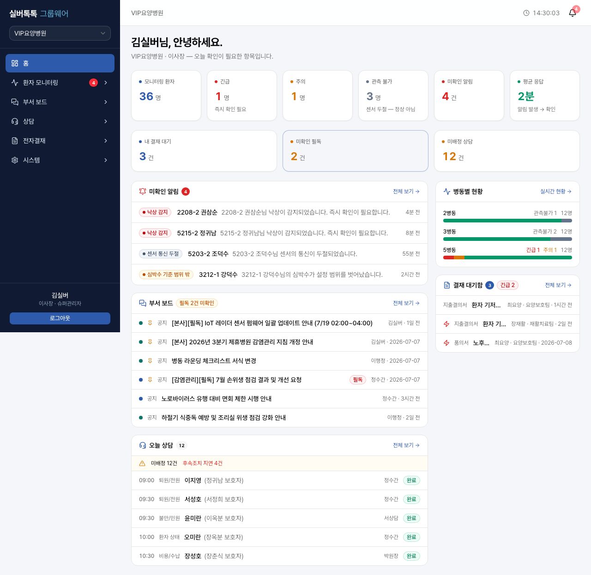

로그인하면 **오늘 확인해야 할 것**이 한 화면에 모입니다.

- **상단(환자 안전)**: 모니터링 환자 / 긴급 / 주의 / **관측 불가** / 미확인 알림 / 평균 응답시간
- **중단(내 업무)**: 내 결재 대기 / 미확인 필독 / 미배정 상담
- **본문**: 미확인 알림 피드 · 부서 보드 다이제스트 · 오늘 상담 · 병동별 현황 · 결재 대기함

모든 지표 카드는 클릭하면 해당 모듈로 넘어갑니다.

---

## 3. 환자 모니터링 `/mon` — 핵심 모듈

### 3.1 실시간 현황

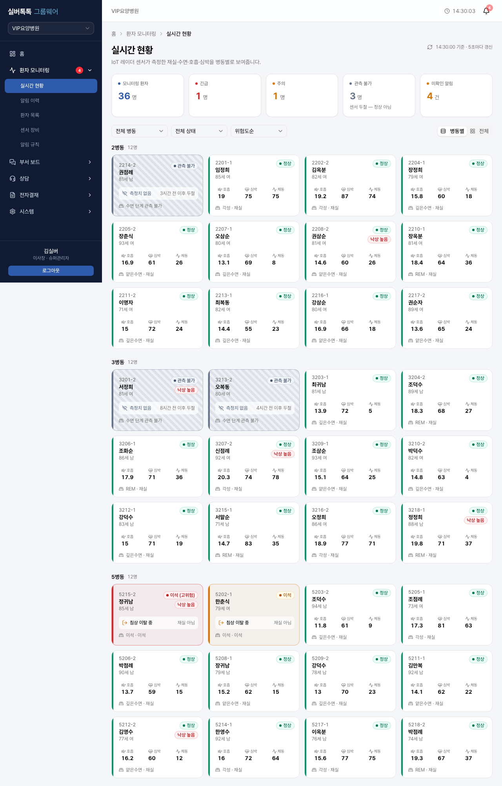

병동·호실 그리드에 환자 상태가 5초마다 갱신됩니다.

- 카드마다 **호흡수 · 심박수 · 체동지수 · 수면단계 · 재실 여부**
- 상태 색은 4가지로만: **긴급(빨강) / 주의(주황) / 정상(초록) / 관측 불가(회색)**
- **관측 불가 카드는 회색 빗금 + "측정치 없음" + "3시간 전 이후 두절"** — 숫자를 지어내지 않습니다
- 낙상 고위험 환자는 별도 배지
- 병동별 그룹 뷰 / 전체 그리드 뷰 전환, 병동·상태·정렬 필터

### 3.2 알림 이력

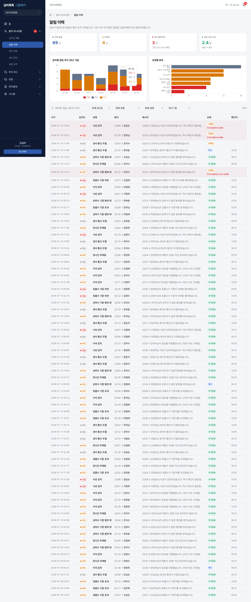

- 상단: **일자별 추이**(긴급/주의/정보 적층) · **유형별 분포** · 전체/미확인/에스컬레이션/**평균 응답시간**
- **에스컬레이션된 미확인 알림은 분홍 배경 + "에스컬레이션 4분째"** 로 강조 — 방치된 알림이 눈에 띕니다
- 확인(ACK) → 조치완료(조치 내용 입력) 흐름
- **낙상 알림에는 "사고보고서 기안" 버튼** → 전자결재로 연결 (§6.1)

> **알림 문구가 "호흡수 기준 미만"·"심박수 기준 범위 밖"인 이유**
> "호흡 저하"·"심박 이상"은 임상 판정으로 읽혀 **의료기기 인허가 트랙**으로 넘어갈 위험이 있습니다.
> 관측 사실만 진술하도록 전 화면 문구를 정리했습니다. (근거: 식약처 웰니스 판단기준)

### 3.3 환자 목록 · 수면 리포트

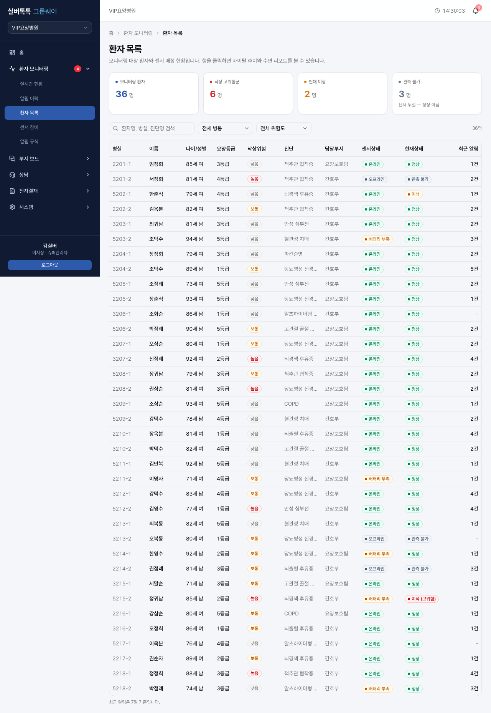

- 병실 · 나이/성별 · 요양등급 · 낙상위험 · 진단 · 담당부서 · 센서상태 · 현재상태 · 최근 알림 수
- 행 클릭 → 상세: **최근 8시간 호흡·심박 차트**, **수면 리포트**(단계별 시간 · 수면효율 · 이석 횟수), 알림 이력, 센서 상태

### 3.4 센서 장비

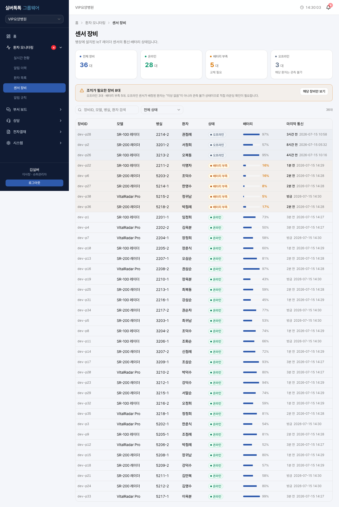

- 장비별 상태 · 배터리 · 마지막 통신 시각
- **오프라인·배터리부족 장비를 상단에 고정** — 조치가 필요한 장비를 놓치지 않게

### 3.5 알림 규칙 (부서장 이상)

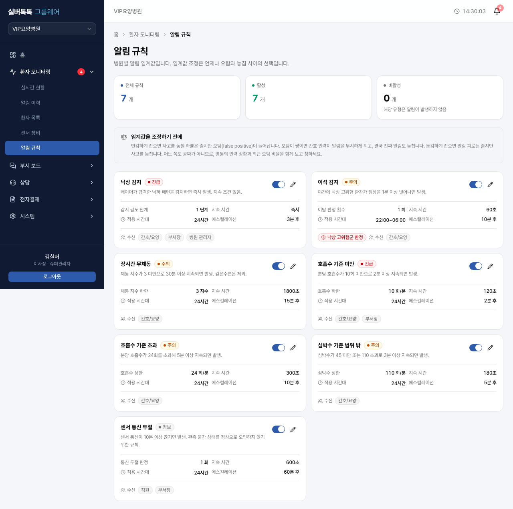

병원마다 임계값을 직접 조정합니다.

| 항목 | 의미 |
|---|---|
| **임계값** | 유형마다 의미가 다름 (회/분, 체동지수, 감도 단계) |
| **지속 시간** | 임계 초과가 N초 이상 지속돼야 알림 — **오탐 억제** |
| **적용 시간대** | 야간 이석처럼 특정 시간에만 |
| **고위험군 한정** | 낙상 고위험 환자에게만 |
| **수신 역할** | 누가 받는가 |
| **에스컬레이션** | 미확인 시 상급자 통보까지의 시간 |

> **임계값을 조정하면 오탐↔놓침 트레이드오프를 화면이 직접 설명합니다.**
> ("기존 1단계 → 3단계. 알림이 줄어듭니다 — 놓칠 위험이 커집니다")
> 조사 범위 안에서 이걸 UI로 드러내는 경쟁 제품을 찾지 못했습니다.

---

## 4. 부서 보드 `/board`

### 4.1 전체 피드

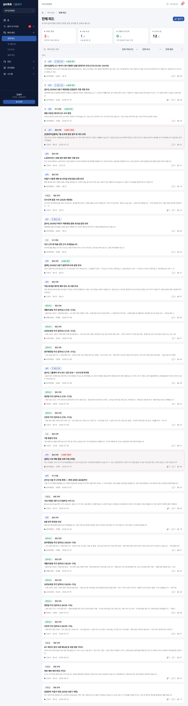

내가 볼 수 있는 글만 모아 보여줍니다. 공개 범위는 3단계 — **부서 전용 / 병원 전체 / 전 병원 공유**(실버톡톡 본사 공지).

### 4.2 인수인계 — 요양병원 핵심

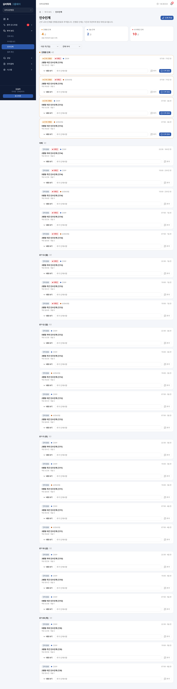

- **근무조(야간 07:00 / 주간 15:00 / 저녁 22:30) × 날짜** 격자로 정리
- **처리 안 된(OPEN) 인계 사항이 최상단에 강조**되고, "인계 완료" 버튼으로 닫습니다
- 댓글로 추가 인계사항을 붙일 수 있습니다
- 본문에 실제 환자의 호실·성함·진단명·낙상위험도가 들어갑니다

### 4.3 필독 확인

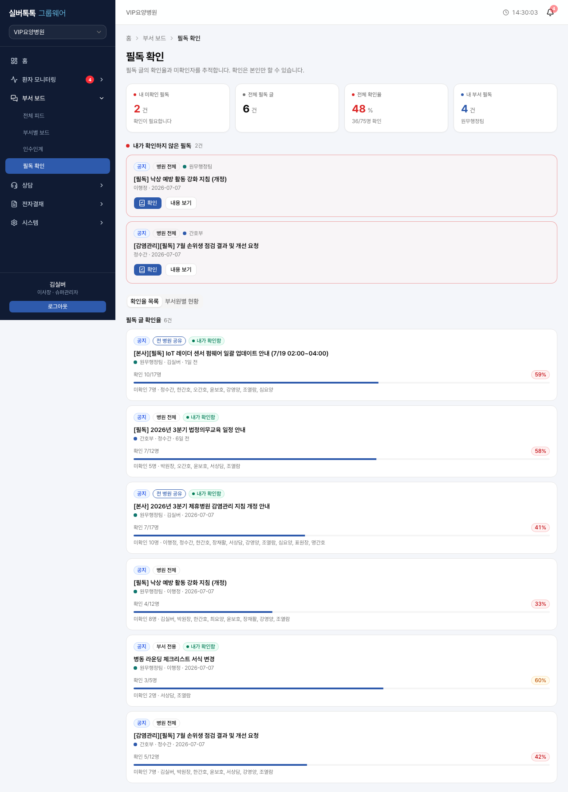

- **확인율 진행바 + 미확인자 명단** — "공지 봤어?"를 없앱니다
- 부서장은 **부서원 × 글 매트릭스**로 누가 안 읽었는지 한눈에
- 감염관리 지침처럼 안 읽으면 안 되는 글을 추적합니다

### 4.4 부서별 보드

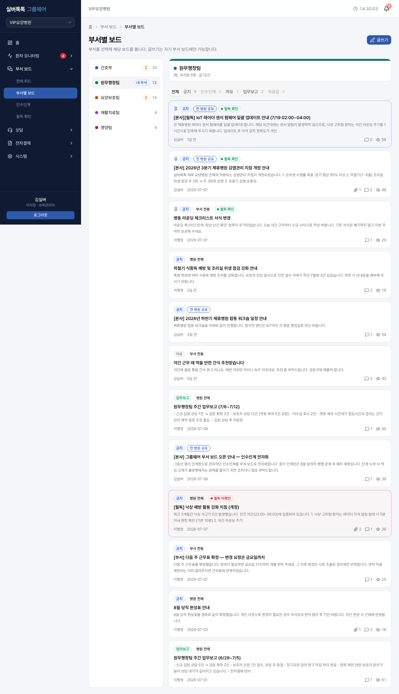

- 부서마다 고유 색상. 간호부 · 원무행정팀 · 요양보호팀 · 재활치료팀 · 영양팀
- **다른 부서 보드는 열람만, 글쓰기는 자기 부서에만**

---

## 5. 상담 `/consult`

### 5.1 상담 현황 (칸반)

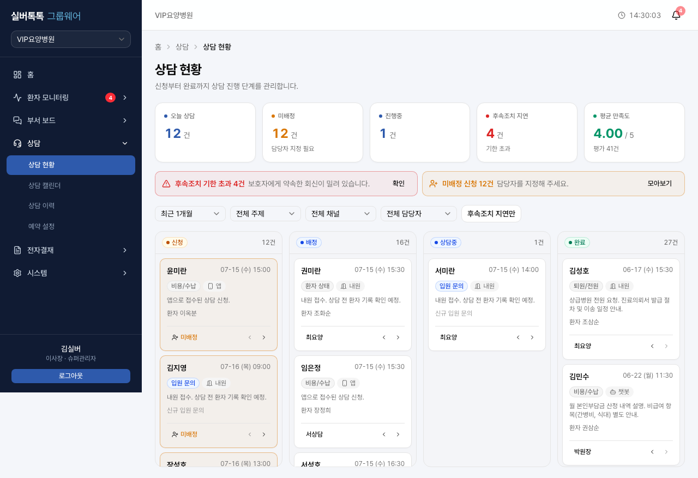

- **신청 → 배정 → 상담중 → 완료** 칸반. 카드에서 담당자 배정·상태 이동
- **미배정 건**과 **후속조치 기한 초과 건**을 상단에 경고로 강조
- 채널(챗봇·전화·내원·앱) · 주제(입원문의·비용·환자상태·불만·퇴원) 구분

### 5.2 상담 캘린더

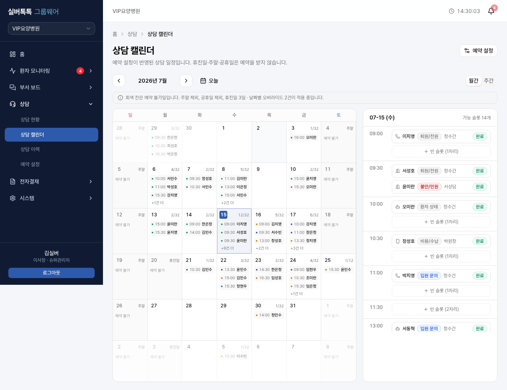

- 월간/주간 뷰. **휴무일은 회색 + "예약 불가"**
- 날짜 클릭 → 그 날 **슬롯별 예약 현황**, 빈 슬롯 클릭으로 상담 추가

### 5.3 상담 이력

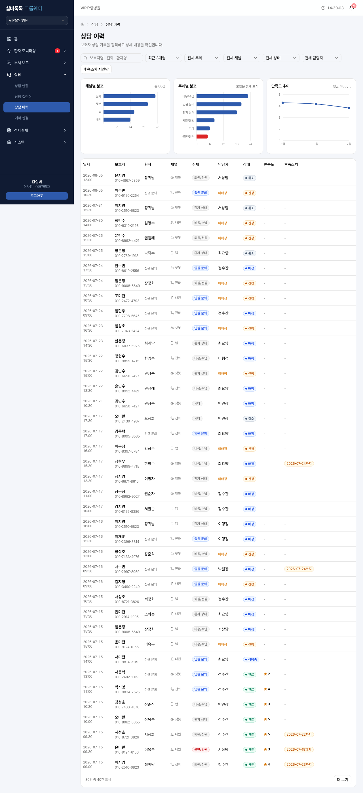

- 검색·필터, 채널별/주제별 분포 차트, 만족도 추이
- 상세: 상담 메모 타임라인, 만족도, 후속조치, **같은 보호자의 과거 상담 이력**

### 5.4 예약 설정 (부서장 이상)

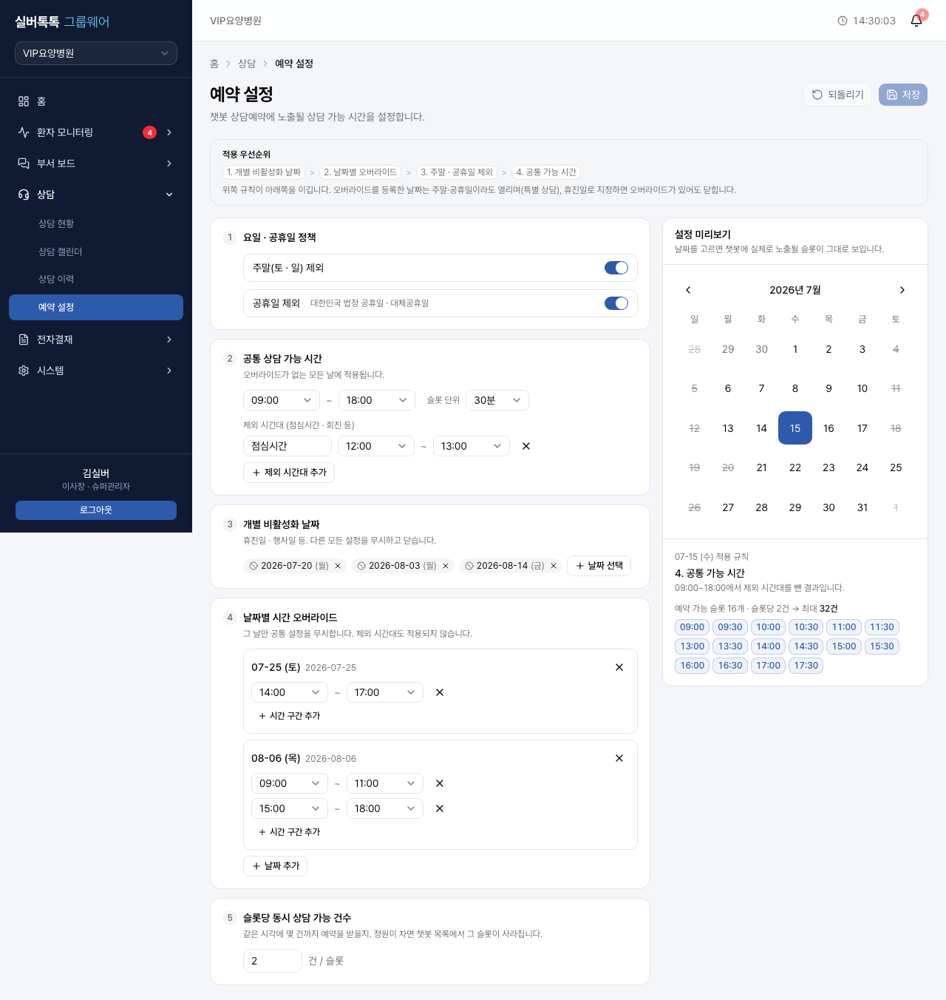

기존 챗봇 상담예약 명세를 화면으로 구현했습니다.

- 주말/공휴일 제외 토글 · 공통 가능 시간 · 점심 등 제외 구간
- 개별 비활성화 날짜 · 날짜별 시간 오버라이드 · 슬롯당 정원
- **미리보기**: 날짜를 고르면 **그 날 실제로 열리는 슬롯이 즉시** 보입니다
  → 명세가 지적한 *"예약 불가한 시간은 애초에 못 고르게"* 원칙의 구현

---

## 6. 전자결재 `/apr`

### 6.1 ★ 기안 작성 — 모니터링 연계

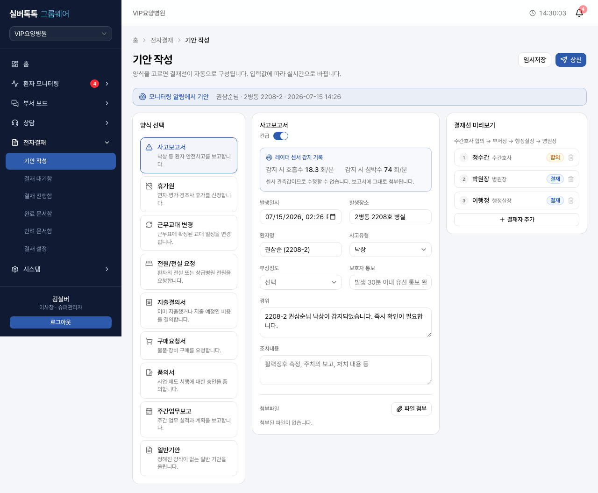

**이 화면이 이 시스템의 핵심 장면입니다.**

낙상 알림에서 "사고보고서 기안"을 누르면:
- **환자 · 병실 · 발생일시**가 자동으로 채워지고
- **레이더 센서 감지 기록**(감지 시 호흡수 18.3 / 심박수 74)이 그대로 첨부되며
- **경위**가 알림 메시지에서 채워지고
- **결재선이 실시간으로 구성**됩니다 (수간호사 합의 → 부서장 → 행정실장 → 병원장)

> 센서 데이터가 **병원 업무로 이어지는** 지점입니다.
> 사고보고서를 손으로 쓰던 일이, 알림 클릭 한 번에서 시작됩니다.

양식은 9종이고, 요양병원 특화 양식(사고보고서 · 전원/전실 요청 · 근무교대 변경)을 포함합니다.

### 6.2 결재 대기함 / 진행함

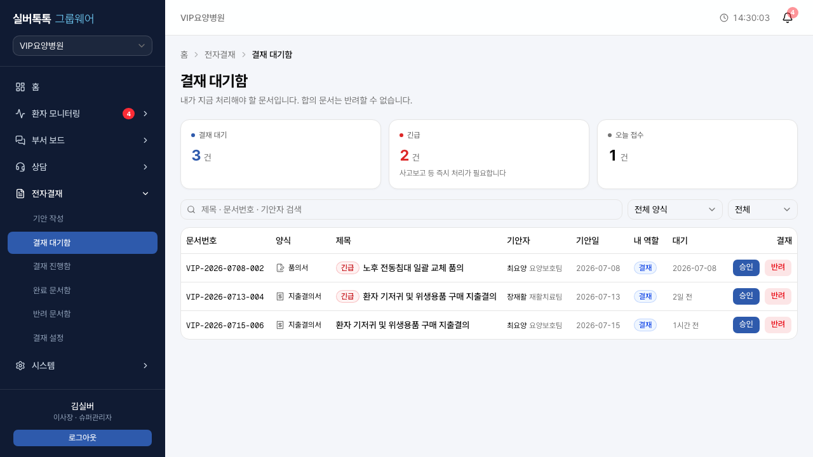

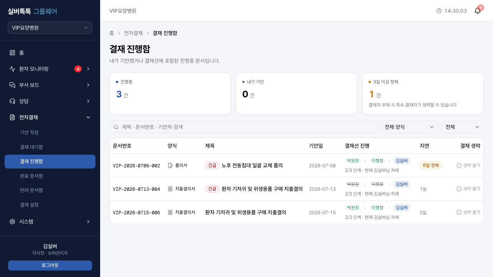

- 문서번호 · 양식 · 긴급 · **내 역할(결재/합의)** · 승인/반려
- **합의자는 반려할 수 없습니다** (버튼이 안 보입니다)
- 진행함에서는 **결재선이 어디까지 왔는지**와 지연 여부를 봅니다

**결재선 자동 구성 규칙** (직위 서열 기반):

| 양식 | 기본 결재선 |
|---|---|
| 휴가원 | 부서장 → (4일↑) 행정실장 → 병원장 |
| 지출결의서 | 부서장 → 행정실장 → (100만↑) 병원장 → (500만↑) 이사장 |
| **사고보고서** | **수간호사 합의 → 부서장 → 행정실장 → 병원장 (긴급)** |
| 전원/전실 | 수간호사 합의 → 병원장 |
| 근무교대 변경 | 부서장 전결 |

---

## 7. 시스템

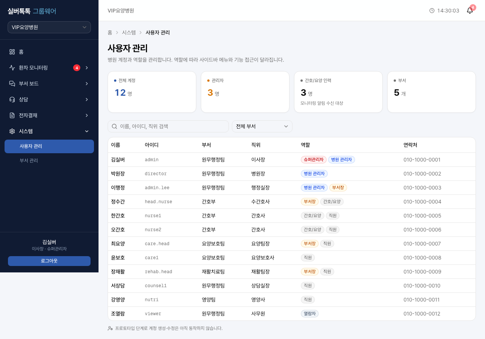

- 계정별 역할 6종 — 슈퍼관리자 / 병원 관리자 / 부서장 / 직원 / 간호·요양 / 열람자
- **역할에 따라 사이드바 메뉴가 자동으로 바뀝니다**
- 부서 관리에서 부서 색상을 정하면 **부서 보드에 그대로 반영**됩니다

---

## 8. 기술 구성

| 항목 | 내용 |
|---|---|
| 프레임워크 | Next.js 16 (App Router) · React 19 · TypeScript |
| UI | Tailwind CSS v4 · shadcn/ui · Pretendard |
| 차트 | Recharts |
| 상태 | zustand |
| 현재 데이터 | **목(mock) 데이터** — 시드 기반 결정론적 생성 |

**IoT 연동 준비 상태**: 현재 `src/lib/mock/vitals.ts`가 센서 시뮬레이터 역할을 합니다.
실제 센서가 붙으면 **데이터 소스 계층만 교체**하고 화면은 그대로 씁니다.
다만 실제 연동은 푸시(MQTT/Webhook) 방식이고 벤더마다 출력 항목이 달라,
`VitalsSource` 인터페이스 + 벤더 어댑터 **3계층 구조**로 설계할 예정입니다.

---

## 9. 다음 단계

| 단계 | 내용 | 선행 조건 |
|---|---|---|
| **1. IoT 규격 확정** | 출력 항목 · 전송 방식 · 낙상 판정 주체 · 학습기간 | IoT 파트너사 API 문서 |
| **2. 보호자 앱 노출 범위 합의** | 무엇을 보호자에게 보여줄 것인가 | **VIP요양병원 협의** |
| **3. 데이터 계층 구현** | `VitalsSource` 3계층 + 수집·저장 | 1번 완료 |
| **4. DB · API · 인증** | 프로토타입 → 실제 시스템 | 화면 확정 |
| **5. 병원 현장 검증** | 오탐률·알림 피로 실측 | 파일럿 |

### 짚어둘 것

- **초기 배포 시 오탐 30%를 전제로** 인력 운영 계획이 필요합니다. 업계 실측 근거가 있습니다.
- **"낙상을 줄인다"는 표현은 쓰지 않습니다.** 대규모 RCT가 이를 지지하지 않습니다.
  → **"낙상 발견 지연을 줄이고, 조치 이력을 남긴다"**
- **학습 기간 2주**가 업계 표준입니다. 설치 직후 알림을 보내지 않는 기간을 일정에 넣어야 합니다.

---

*실버톡톡 · 2026-07-15*
